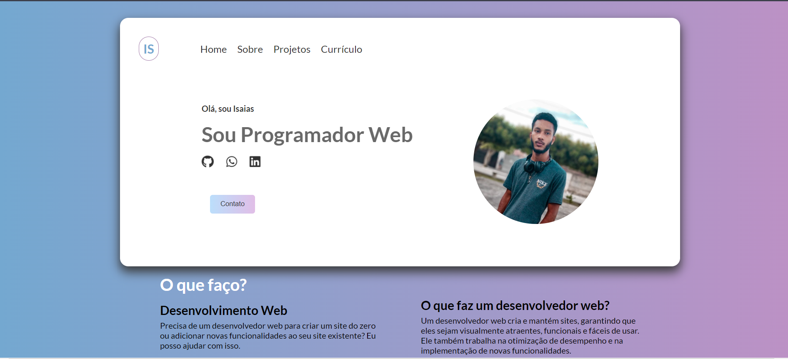

<h1 align="center"> Portfólio </h1>

Projeto final do curso de programação full stack da Infinity school .  

  <a href="#-tecnologias">Tecnologias</a>&nbsp;&nbsp;&nbsp;|&nbsp;&nbsp;&nbsp;
  <a href="#-projeto">Projeto</a>&nbsp;&nbsp;&nbsp;
 

 

  

## 🚀 Tecnologias

Esse projeto foi desenvolvido com as seguintes tecnologias:

- HTML e CSS
- JavaScript
- Git e Github

## 💻 Projeto

 Portfólio pessoal para demostra eu quem sou e minhas competências.

- [Acesse o projeto finalizado, online](https://tikorsm.github.io/portf-lio-html/)

